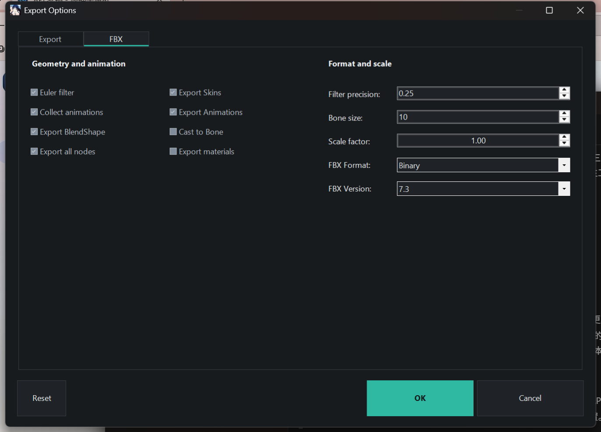
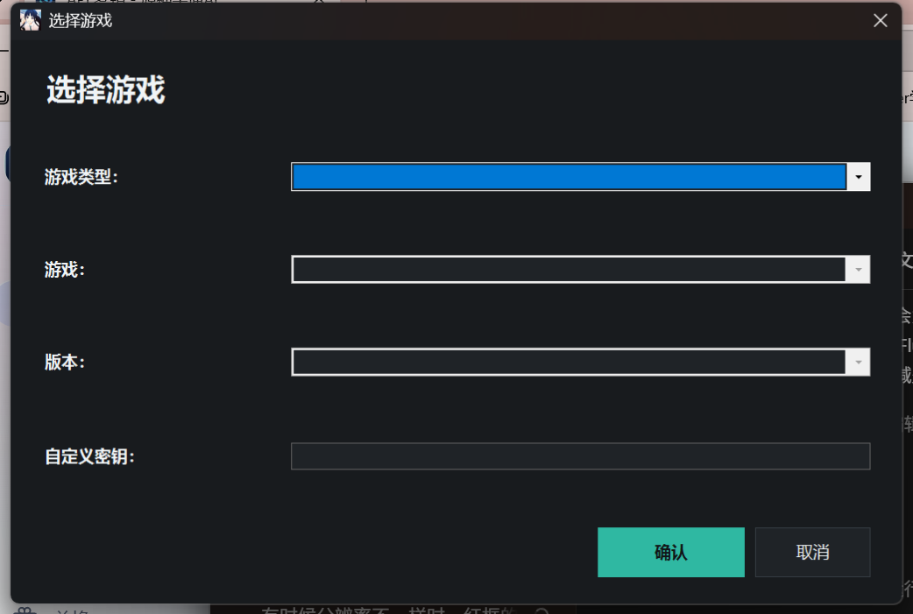
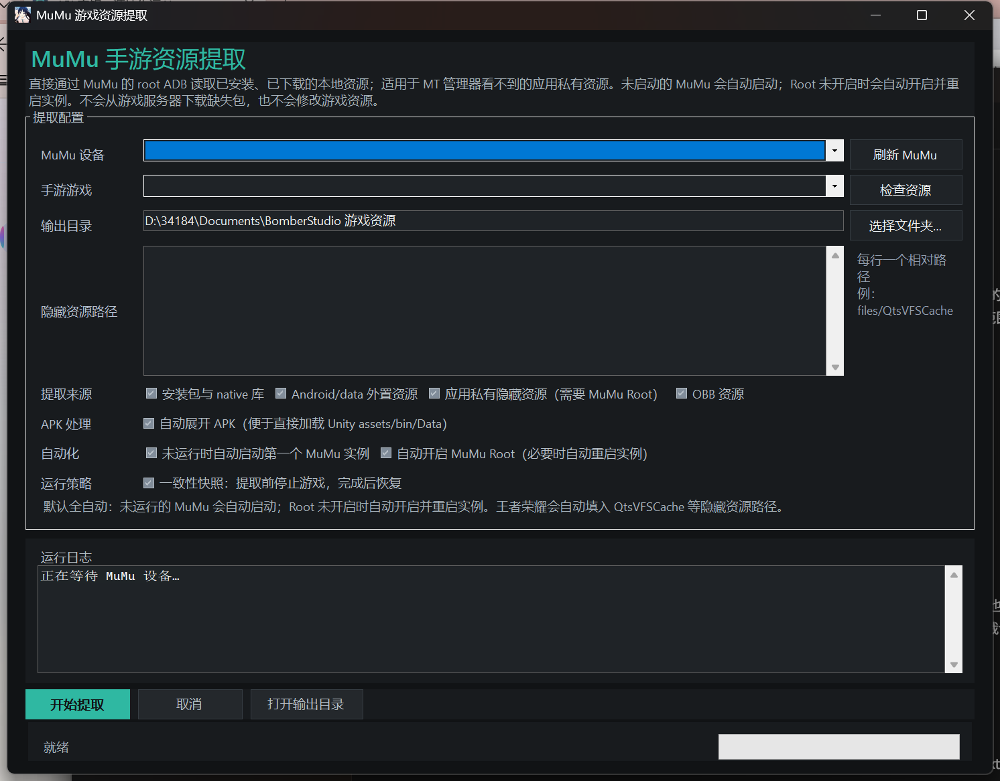

# BomberStudio

### Unity 游戏资源浏览、预览与导出工具

BomberStudio 是一个面向 Windows 的桌面工具，用来打开 Unity 游戏资源和各种专用容器。你可以在同一个界面里浏览资源、预览内容、建立索引，并把需要的文件导出到本地。

加载文件前，请先选择与资源版本对应的游戏配置。不同游戏和版本的支持深度并不相同，遇到同名配置时应以资源来源和日志结果为准。

## 能做什么？

- 加载单个文件、文件夹、分片资源和资源包目录，支持直接拖放。
- 按名称、类型、容器、路径或哈希值搜索资源。
- 预览贴图、精灵、网格、材质、着色器、动画、音频、视频、文本和原始资源。
- 导出贴图、模型、动画、音频、视频、YAML、JSON、XML、原始数据和转储文件。
- 将模型和动画导出为 `FBX` 或 `OBJ`，源数据包含时保留蒙皮、骨骼、材质和形态键。
- 建立并复用 `AssetMap`、`CABMap` 和资源索引，适合大型游戏安装目录。
- 解析依赖关系和 `PPtr` 引用；只想快速查看时，也可以使用轻量扫描方式。
- 通过命令行执行批量任务，并按类型、名称、容器、引擎版本和输出格式筛选。

## 支持的格式

核心读取器支持常见的 Unity 文件，也支持多种游戏专用容器和预处理层：

- `UnityFS`、`UnityWeb`、`UnityRaw`、`AssetBundle`、`SerializedFile`、分片文件、`UnityCN` 和伪文件头资源。
- `VFS`、`QtsVFS`、`BLC`、`CHK`、`BLB`、`PCK`、`MPK`、`CDPH` 等项目专用容器。
- `CRI` 的 `ACB`、`AWB`、`USM`，以及 `Wwise` 的 `WEM`、`BNK`、`PCK` 音频和媒体文件。
- `LZ4`、`LZMA`、`Brotli`、`Zstd`、`GZip` 和 `Oodle` 等压缩层；其中 `Oodle` 需要对应的原生库。

无法识别的内容会尽量以原始资源保留下来，不会直接丢弃。

## 支持的游戏

游戏选择器内置了大量 Unity 游戏配置，也包含一些历史版本和测试版本。下面是覆盖较多的系列：

- **米哈游系列：** 原神、崩坏3、崩坏：星穹铁道、绝区零、未定事件簿，以及相关测试版本。
- **网易系列：** 逆水寒手游、燕云十六声、永劫无间、永劫无间手游、天下3、遗忘之海和通用 `MPK` 配置。
- **腾讯系列：** 王者荣耀、王者万象棋、穿越火线手游、火影忍者，以及其他相关配置。
- **鹰角与叠纸系列：** 明日方舟、明日方舟：终末地、恋与深空、闪耀暖暖。
- **其他游戏配置：** 战双帕弥什、重返未来：1999、世界计划、动物派对、冰汽时代，以及多种 `UnityCN` 和自定义密钥配置。

这里列出的是配置，不代表所有游戏版本都能完全互换。一个游戏有多个条目时，请选择与手头文件对应的版本；如果遇到无法识别的格式，请保留日志和一份小样本，便于排查。

## 下载

可以从[发布页](https://github.com/Hoshino486/Unpackaging-tool/releases)获取最新安装包，当前源码版本为 `1.1.3`。

正式安装包面向 Windows x64，需要安装 **.NET 10 桌面运行时**。

## 使用方法

1. 启动 BomberStudio，选择与资源文件相匹配的游戏配置。
2. 使用“文件 -> 加载文件”或“文件 -> 加载文件夹”，也可以把文件或文件夹直接拖到窗口中。
3. 浏览资源列表；处理大型目录时，先使用搜索框和类型筛选，再打开预览。
4. 选中需要的资源，确认预览结果后点击“导出选中项”。
5. 对于大型安装目录，建议先建立 `AssetMap` 或 `CABMap`。索引可以保存并在下次直接加载，避免重复扫描。

图形界面适合日常浏览和预览，命令行适合重复导出和批量处理。

## 界面截图

| 游戏选择 | `FBX` 导出 | 模拟器资源提取 |
| --- | --- | --- |
|  |  |  |

## 反馈

如果软件无法正常工作，欢迎在[问题页面](https://github.com/Hoshino486/Unpackaging-tool/issues)提交日志和可复现的小样本，反馈的时候最好有截图，软件截图，解包的文件截图，模型id等，越详细修的越快，并带上日志发我。
